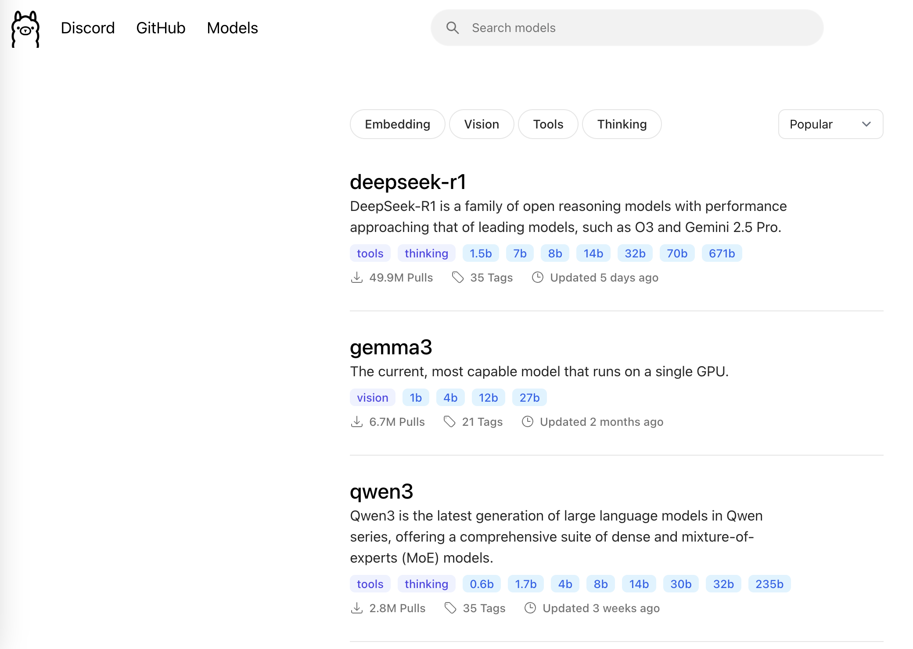
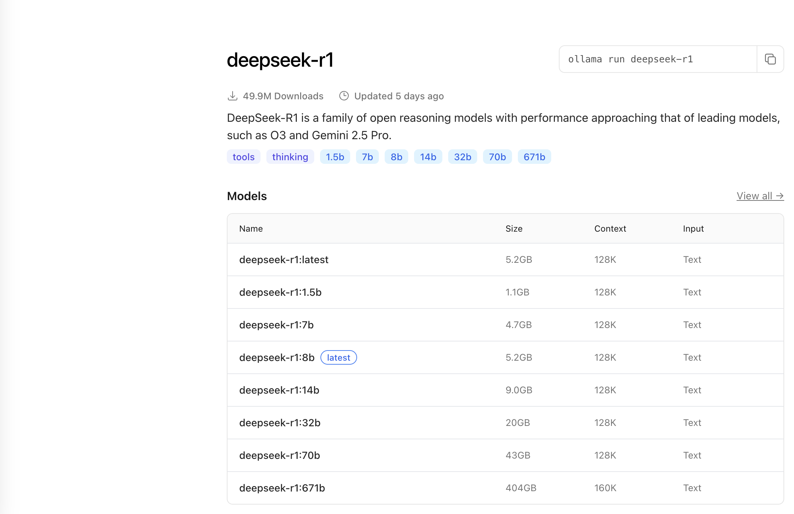

Ollama是一个开源工具，用于本地运行大模型，它的特点是使用简单，配置方便。本文介绍如何使用Ollama。<!--more-->

## 一、安装Ollama

- Windows / MacOS

访问[Ollama官方网站](https://ollama.com/)下载安装包。

- MacOS

```shell
brew install ollama
```

- Linux

```shell
curl -fsSL https://ollama.com/install.sh | sh
```

- Docker

拉取Docker镜像：

```shell
docker pull ollama/ollama
```

安装完成后，执行如下命令查看版本号：

```shell
ollama -v
```

查看使用说明：

```shell
ollama -h
```

结果：

```shell
Usage:
  ollama [flags]
  ollama [command]

Available Commands:
  serve       Start ollama
  create      Create a model from a Modelfile
  show        Show information for a model
  run         Run a model
  stop        Stop a running model
  pull        Pull a model from a registry
  push        Push a model to a registry
  list        List models
  ps          List running models
  cp          Copy a model
  rm          Remove a model
  help        Help about any command

Flags:
  -h, --help      help for ollama
  -v, --version   Show version information

Use "ollama [command] --help" for more information about a command.
```

Ollama是客户端-服务端架构，执行`ollama serve`开启服务端。

## 二、运行模型

Ollama支持多个模型，例如deepseek-r1和qwen3等，可访问[官网模型入口](https://ollama.com/search)查看具体模型。



点击模型名称，可以看到不同类型的模型：



下载模型：

```shell
ollama pull <模型名称>
```

查看已下载模型：

```shell
ollama list
```

查看模型信息：

```shell
ollama show <模型名称>
```

运行模型（如果本地没有该模型，则会先进行下载）：

```shell
ollama run <模型名称>
```

可以看到，通过Ollama来下载及在本地运行模型，非常简单方便。