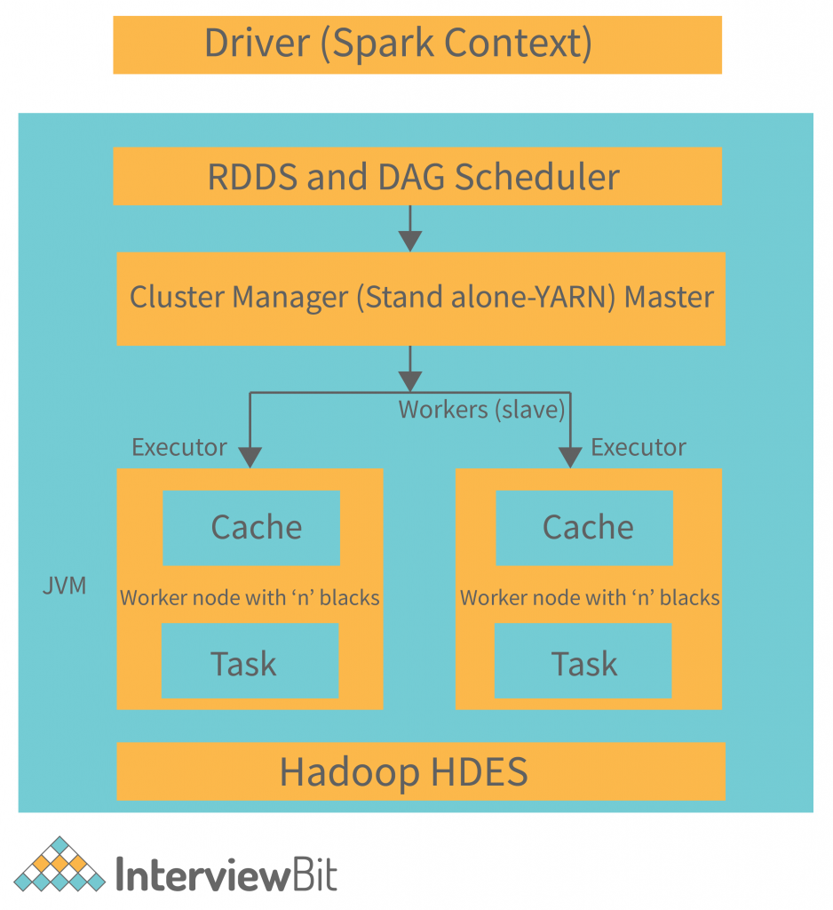
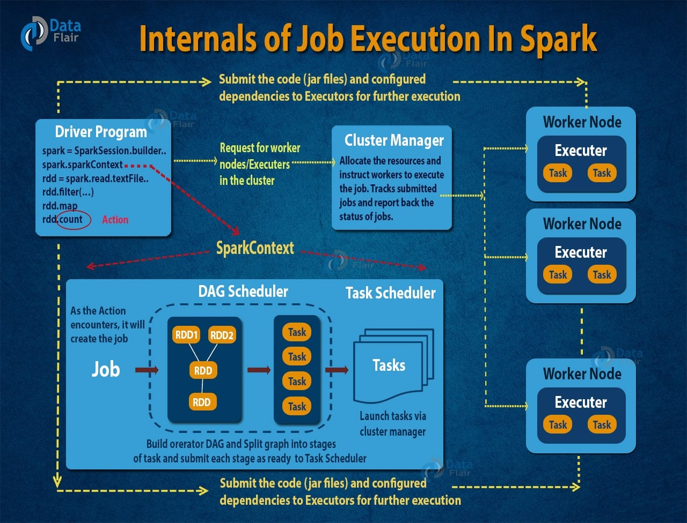
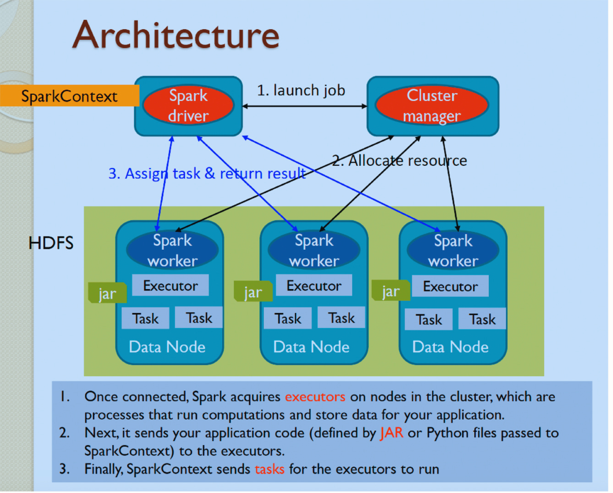

Spark是一个开源的分布式计算框架，起源于加州大学伯克利分校的AMPLab，在2013年捐赠给Apache软件基金会，目前是Apache顶级项目之一 。Spark提供了一个统一的数据处理引擎，能够在集群上执行批处理作业、交互式查询、流处理、机器学习等多种计算任务。

与Hadoop的MapReduce计算框架相比，Spark通过内存计算技术大大减少了磁盘I/O操作，将中间结果存储在内存中，从而实现了数量级的性能提升。同时，Spark提供了ANSI SQL查询和机器学习能力，常用于大规模数据的批处理和流处理。<!--more-->

## 一、Spark特点

### 高性能
通过将数据存储在内存中进行计算，Spark能够比基于磁盘的MapReduce快100倍左右。另一方面，Spark的DAG执行引擎能够优化整个数据处理流水线，避免不必要的中间结果写入磁盘的操作。

### 易用性
Spark提供了简洁而强大的API，支持多种编程语言。其核心API包括Spark Core、Spark SQL、Spark Streaming、MLlib和GraphX等组件，为不同的数据处理需求提供了专门的解决方案。开发者可以使用Scala、Java、Python或R语言编写Spark应用程序。

### 容错性
当某个节点出现故障时，Spark能够通过血统机制（lineage）重新计算丢失的数据分区，而不需要像传统系统那样复制整个数据集。这种设计既保证了数据的安全性，又提高了存储效率。

### 统一平台
Spark提供了一个统一的计算平台，能够处理批处理、流处理、交互式查询、机器学习等多种不同类型的数据处理任务。这种统一性使得开发者可以在同一个框架下处理不同的数据处理需求，大大简化了系统架构。

### 可扩展性
Spark设计具有良好的可扩展性，能够在从单机到数千台机器的集群环境中运行。它支持多种集群管理器，包括Spark自带standalone模式、Apache Mesos、Hadoop YARN等。

## 二、整体架构

Spark采用了主从（Master-Slave）的分布式架构，主要由以下组件构成：

### 集群管理器（Cluster Manager）
集群管理器负责集群资源的分配和管理。Spark支持多种集群管理器：
- **Standalone模式**：Spark自带的简单集群管理器
- **Apache Mesos**：通用的集群资源管理器
- **Hadoop YARN**：Hadoop生态系统中的资源管理器
- **Kubernetes**：容器编排平台

### 驱动程序（Driver Program）
驱动程序是Spark应用程序的入口点，负责创建SparkContext并协调整个Spark作业的执行。它分析应用程序，将其转换为DAG（有向无环图），并将任务分发给执行器。

### 执行器（Executor）
执行器是运行在集群工作节点上的进程，负责执行具体的计算任务。每个执行器管理自己的JVM进程和内存空间，可以并行处理多个任务。

### RDD（弹性分布式数据集）
RDD是Spark的核心数据抽象，代表一个不可变、分区的数据集合。它提供了强大的转换和操作能力，同时具有自动容错和负载均衡的特性。在RDD的基础上，Spark提供了更高层次的数据抽象：

- **DataFrame**：类似表格的结构化数据，类似于关系型数据库中的表
- **Dataset**：强类型的数据集合，提供了类型安全和编译时检查

## 三、执行原理

### DAG执行引擎
当用户提交一个Spark应用程序时，驱动程序会将用户的操作转换为DAG。每个节点代表一个RDD操作，边表示RDD之间的依赖关系。Spark根据DAG的拓扑结构，将任务划分为不同的阶段（stage）。

### 阶段划分
Spark根据shuffle操作将DAG划分为不同的阶段。每个阶段内部的任务可以并行执行，而不同阶段之间需要通过shuffle进行数据交换。这种设计使得Spark能够优化任务的执行顺序，减少磁盘I/O操作。

### 内存计算
Spark的核心优势在于其内存计算能力。当RDD被创建时，其分区数据会被加载到执行器的内存中。后续的转换操作直接在内存中进行，大大减少了磁盘I/O。Spark使用了统一内存管理机制，在执行内存和存储内存之间进行动态分配。

### 容错机制
Spark通过血统机制（lineage）实现容错。当某个RDD分区丢失时，Spark可以根据原始RDD和一系列转换操作重新计算该分区，而不需要复制整个数据集。这种方法既节省了存储空间，又保证了数据的完整性。

### 懒评估（Lazy Evaluation）
Spark采用了懒评估的策略，只有当遇到行动操作（action operation）时才会真正开始执行计算。这种设计使得Spark能够优化整个执行计划，避免不必要的中间计算。

## 四、总结

作为分布式计算框架，Spark在大数据处理领域具有重要的地位。它通过内存计算、DAG执行引擎和统一的数据处理API，成功地解决了传统MapReduce在性能和易用性方面的不足。随着大数据技术的不断发展，Spark持续演进，添加了更多新特性和优化。其生态系统不断壮大，从基础的Spark Core扩展到了Spark SQL、Spark Streaming、MLlib、GraphX等专门的应用领域。Spark的成功不仅推动了分布式计算技术的发展，也为现代数据科学和机器学习应用提供了强大的基础设施支持。在未来，Spark将继续在提升性能、增强易用性和扩展应用场景方面发挥重要作用，为大数据处理和实时分析提供更加高效和便捷的解决方案 。

